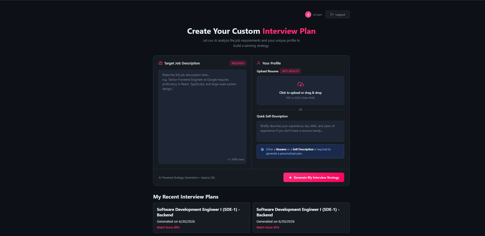
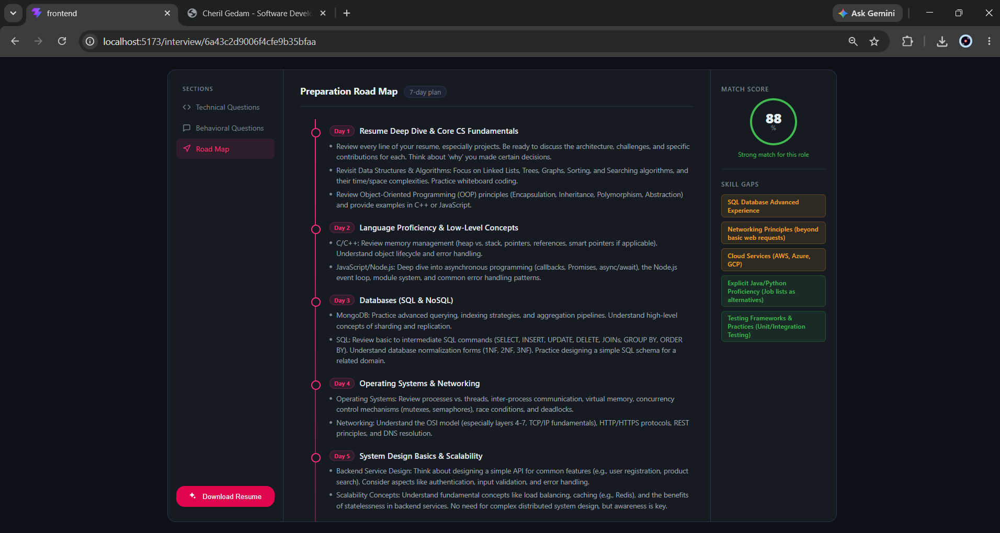
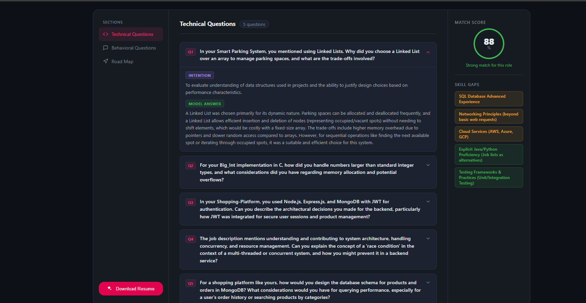

# InterviewAI - AI-Powered Interview Preparation Platform

InterviewAI is a full-stack platform that helps job seekers prepare for interviews. By uploading a resume and providing a job description, the application leverages Google's Gemini AI to generate a highly tailored interview preparation strategy, including technical questions, behavioral questions, skill gap analysis, and a day-by-day preparation roadmap.

## 📸 Live Demo & Screenshots



<br/>

<br>

<br/>

## 🚀 Features

- **Resume Parsing & PDF Generation:** Upload resumes in PDF or DOCX format or input a quick self-description.
- **AI-Powered Match Scoring:** Get an instant match score assessing how well your profile aligns with the target job description.
- **Custom Question Banks:** Receive generated Technical and Behavioral questions tailored to the job, complete with interviewer intentions and sample answers.
- **Actionable Roadmaps:** Get a customized, day-by-day study plan highlighting exactly what to focus on to crush the interview.
- **Skill Gap Analysis:** Identify missing skills required by the job, categorized by severity (Low, Medium, High).
- **Authentication:** Secure user registration and login system with persistent sessions via HTTP-only cookies.

## 🛠️ Tech Stack

### Frontend
- React 19 (Vite)
- React Router DOM v7
- Vanilla CSS / SCSS (Custom Design System with Glassmorphism)
- Axios for API requests

### Backend
- Node.js & Express.js
- MongoDB & Mongoose (Database)
- Google GenAI SDK (Gemini 2.5 Flash model)
- Puppeteer (for HTML to PDF rendering)
- JWT & bcryptjs for Authentication
- Multer & PDF-Parse for file handling

## 📂 Project Structure

This is a monorepo consisting of:
- `/frontend` - The React application
- `/backend` - The Node.js/Express API server

## ⚙️ Local Setup

### Prerequisites
- Node.js (v18+)
- MongoDB (Local instance or MongoDB Atlas)
- Google Gemini API Key

### 1. Clone the repository
```bash
git clone https://github.com/yourusername/interview-ai.git
cd interview-ai
```

### 2. Backend Setup
```bash
cd backend
npm install
```
Create a `.env` file in the `backend` directory:
```env
PORT=3000
MONGODB_URI=mongodb://127.0.0.1:27017/interviewAI
JWT_SECRET=your_jwt_secret_here
GOOGLE_API_KEY=your_gemini_api_key_here
```
Run the backend:
```bash
npm run dev
```

### 3. Frontend Setup
Open a new terminal.
```bash
cd frontend
npm install
```
Run the frontend:
```bash
npm run dev
```

### 4. Open Application
Navigate to `http://localhost:5173` in your browser.

## 📝 License

This project is open-source and available under the ISC License.
